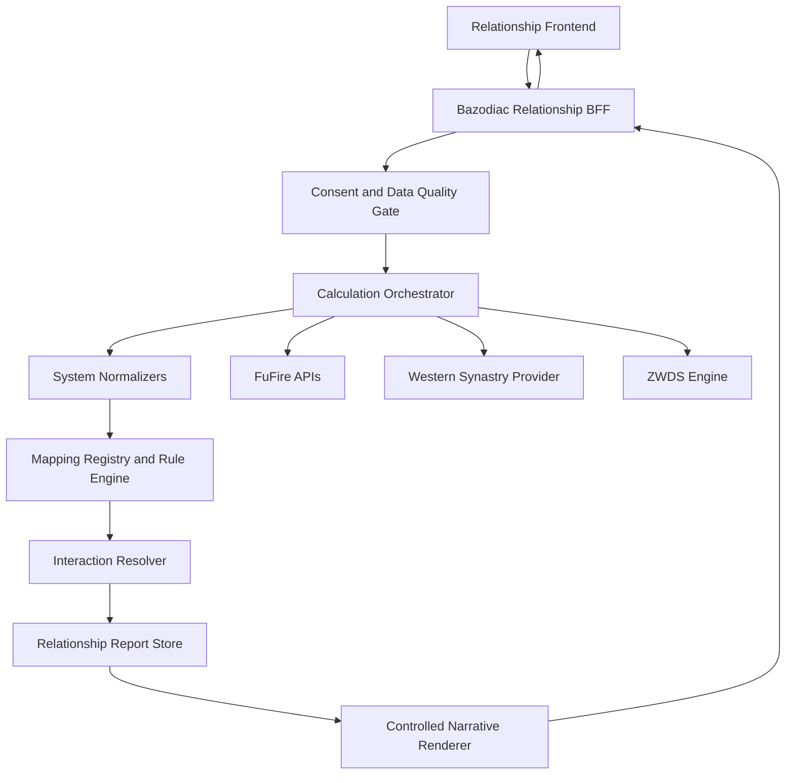

# System Architecture

## 1. Decision summary

Bazodiac Relationship uses a server-side Backend-for-Frontend (BFF) to orchestrate FuFire and other calculation providers. The browser receives a normalized relationship report, never raw provider credentials or unrestricted calculation responses.

## 2. Context

The product combines multiple systems with incompatible native models:

- BaZi / HeHun / Wu Xing / Da Yun;
- western natal astrology and synastry;
- Zi Wei Dou Shu.

A direct frontend aggregation or unrestricted LLM synthesis would create security, contract, provenance and methodological risks.

## 3. Target architecture



## 4. Processing stages

### Stage 0 — Input and consent

Validate:

- two separate subjects;
- consent state;
- birth time quality;
- confirmed place and timezone;
- requested modules;
- locale and script policy.

### Stage 1 — Deterministic calculation

Each provider computes only its native domain.

No LLM is used for:

- chart calculation;
- synastry geometry;
- BaZi pillars or Day Master;
- Wu Xing values;
- Da Yun periods;
- ZWDS palace or star positions.

### Stage 2 — Contract validation

Every provider response is checked against a versioned schema. Invalid responses fail the affected module and must not be silently coerced.

### Stage 3 — System normalization

Each native result is converted into a stable internal model while preserving:

- native identifiers;
- source feature IDs;
- ruleset version;
- provider version;
- data-quality warnings;
- evidence references.

### Stage 4 — Native meaning objects

Raw features first map to system-native meanings. This prevents direct symbol-to-psychology shortcuts.

### Stage 5 — Neutral relationship signals

Reviewed mapping rules translate native meanings into neutral behavioural hypotheses.

### Stage 6 — Pair interaction resolution

A separate resolver combines:

- Person A signals;
- Person B signals;
- direct pair evidence;
- context and time activation;
- counter-signals.

### Stage 7 — Visibility and family aggregation

Weak or unsupported candidates are removed. BaZi, Wu Xing, HeHun and Da Yun are aggregated as one dependency family.

### Stage 8 — Narrative rendering

A language model may phrase only the already-approved dynamic object. Its output is schema-validated and claim-checked.

### Stage 9 — Frontend rendering

The frontend renders:

- Person A;
- shared dynamic;
- Person B;
- shadow;
- opportunity;
- conditions;
- counter-hypothesis;
- evidence;
- module and source status.

## 5. Major components

### Relationship BFF

Responsibilities:

- input validation;
- authentication and authorization;
- consent enforcement;
- orchestration;
- timeout and partial-failure handling;
- report IDs and retention;
- stable browser contract;
- provider credential isolation.

### Calculation Orchestrator

Runs independent calculations in parallel where possible and preserves module boundaries.

### Normalizer Registry

One adapter per system and provider version.

### Mapping Registry

Stores versioned and reviewable rules:

```text
native feature -> native meaning -> relationship signal
```

### Evidence Resolver

Maintains references from every visible claim back to source feature and mapping rule.

### Family Aggregator

Prevents dependent BaZi modules from masquerading as independent confirmations.

### Interaction Resolver

Creates pair-level dynamics from individual and direct pair signals.

### Claim Validator

Blocks deterministic, diagnostic or unsupported output.

## 6. Error and partial-result model

A failed module does not authorize fabricated fallback content.

Example statuses:

- `COMPLETE`
- `PARTIAL`
- `MISSING_INPUT`
- `SOURCE_NEEDED`
- `PROVIDER_ERROR`
- `BLOCKED`

Cross-system convergence can only be displayed when the required independent families completed successfully.

## 7. Security and privacy

- Provider keys remain in secret storage.
- Browser calls only the BFF.
- Birth data are excluded from ordinary logs.
- Downstream processing uses pseudonymous subject IDs.
- Deletion propagates to report, cache and derived artefacts.
- Raw birth data are not sent to the narrative model by default.
- Structured evidence is minimized before language generation.

## 8. Observability

Every report and provider call includes:

- request ID;
- report ID;
- subject pseudonyms;
- module name;
- provider version;
- mapping version;
- duration;
- result status;
- error code without sensitive payloads.

## 9. Evolution strategy

Start with versioned JSON/YAML rules and relational evidence references. Evaluate a graph database only when rule volume and multi-hop queries justify the operational cost.

## 10. Architecture quality gates

- No direct provider credentials in the browser.
- No provider response used without schema validation.
- No visible dynamic without evidence IDs.
- No LLM-generated mapping.
- No hidden fallback to demo or fixture data.
- No ZWDS pair claim before reviewed rules exist.
- No single compatibility score.
